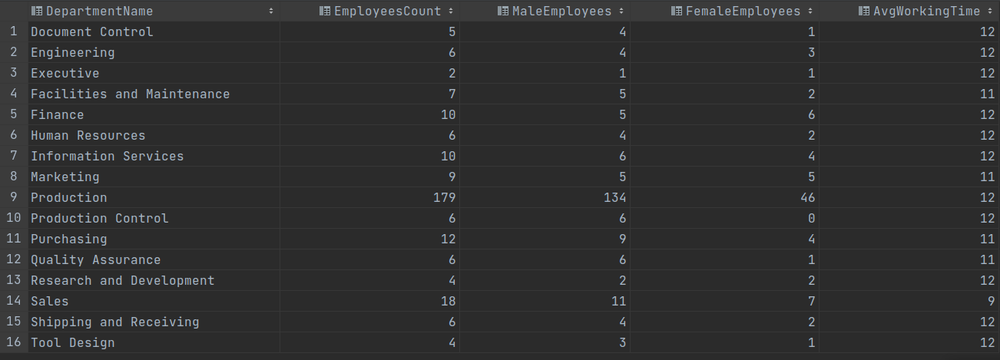

# CHALLENGE QUESTION 1: 

##Department Summary from Human Resources

###Difficulty: Intermediate

An executive requests data concerning the employee distribution on each department. 

Your output should include the following columns:

* Department name
* Employee Count
* Males Employee
* Male Percent 
* Females Employee
* Females Percent
* Avg Employee Hired Time

Sample Output:
